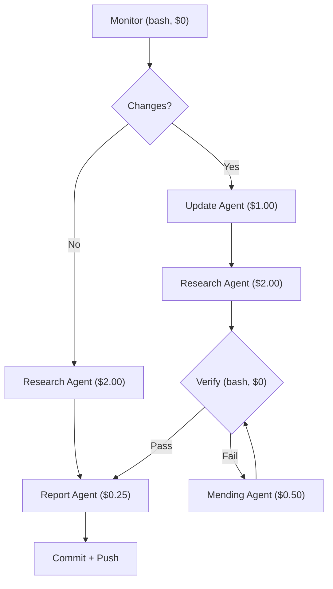

# Claude Agent SDK Skill (Auto-Updated)

A self-updating Claude Code skill for building AI agents with the [Claude Agent SDK](https://github.com/anthropics/claude-agent-sdk-typescript) (`@anthropic-ai/claude-agent-sdk`).

**SDK Version**: v0.2.37 | **This skill is auto-updated**: 2026-02-11T09:38:26Z

## What It Does

- Complete TypeScript API reference: `query()`, hooks, subagents, MCP, permissions, sandbox, structured outputs, sessions
- Auto-correction rules that fire when editing `*agent*.ts` files
- Known issue prevention with links to real GitHub issues
- Keeps itself up to date via a daily automated pipeline

## Why Auto-Update?

The Claude Agent SDK is pre-1.0 (`v0.2.x`) — APIs break frequently, functions get renamed, parameters change. A static skill would teach Claude outdated patterns that produce broken code. The pipeline keeps this skill accurate by tracking version bumps, researching new issues, and updating rules daily. Without it, advice written for `v0.2.30` silently becomes wrong when the SDK moves to `v0.3.0`.

## Installation

Clone into your Claude Code skills directory:

```bash
git clone https://github.com/xiaolai/claude-agent-sdk-skill-autoupdated ~/.claude/skills/claude-agent-sdk-skill-autoupdated
```

Claude Code loads it automatically. To pull the latest updates later:

```bash
cd ~/.claude/skills/claude-agent-sdk-skill-autoupdated && git pull
```

That's it — no API keys, no pipeline setup, no cost. You get a constantly up-to-date SDK skill maintained by the automated pipeline.

Optional: auto-update daily at 09:00 UTC (after the pipeline runs at 08:00):

```bash
(crontab -l 2>/dev/null; echo "0 9 * * * cd ~/.claude/skills/claude-agent-sdk-skill-autoupdated && git pull -q") | crontab -
```

## Structure

```
SKILL.md                          Main reference (loaded by Claude)
rules/claude-agent-sdk.md         Auto-correction rules for TS files
templates/                        Copy-pasteable code examples
scripts/check-versions.sh         Manual version check
agent/                            Self-update pipeline agents
  monitor.sh                      Change detection (npm + GitHub, zero API cost)
  update-agent.ts                 Updates skill files when SDK version changes
  research-agent.ts               Researches new GitHub issues daily
  mending-agent.ts                Fixes verification failures
  report-agent.ts                 Generates daily reports
  verify.sh                       Deterministic post-update verification
  state.json                      Tracked versions, issues, scan state
reports/                          Daily pipeline reports
.github/workflows/                CI pipeline (daily cron)
```

## Daily Pipeline

Runs via GitHub Actions at 08:00 UTC, or manually via `workflow_dispatch`.



**Monitor** checks npm registry and GitHub for version bumps, issue state changes, and new bugs — no LLM cost.

**Update Agent** reads the change report and updates version strings across all skill files.

**Research Agent** browses new SDK repo issues, evaluates relevance, and updates Known Issues or rules.

**Verify** does deterministic grep/jq checks to confirm all version strings were updated correctly.

**Mending Agent** reads verification failures and fixes specifically what broke.

**Report Agent** generates a markdown summary of the day's pipeline run.

## How It Works

The daily pipeline runs via GitHub Actions on this repo. It costs the **maintainer** a few dollars per day in LLM usage. The pipeline commits updated skill files directly to this repo.

**As a user**, you just `git pull` to get the latest. You never run the pipeline yourself and pay nothing.

| Role | What you do | Cost |
|------|------------|------|
| **User** | `git clone` / `git pull` | Free |
| **Maintainer** | Runs the CI pipeline | ~$2–5/day |

## Pipeline Prerequisites (maintainer only)

- [Claude Code CLI](https://docs.anthropic.com/en/docs/claude-code) installed on the runner
- GitHub secret: `CLAUDE_SETUP_TOKEN` (subscription) or `ANTHROPIC_API_KEY`
- `gh` CLI authenticated (for issue scanning)

## Links

- [SDK Docs](https://platform.claude.com/docs/en/agent-sdk/overview)
- [TypeScript API Reference](https://platform.claude.com/docs/en/agent-sdk/typescript)
- [GitHub](https://github.com/anthropics/claude-agent-sdk-typescript)
- [Changelog](https://github.com/anthropics/claude-agent-sdk-typescript/blob/main/CHANGELOG.md)
- [Migration Guide](https://platform.claude.com/docs/en/agent-sdk/migration-guide)

---

**Repository**: https://github.com/xiaolai/claude-agent-sdk-skill-autoupdated
**License**: MIT
