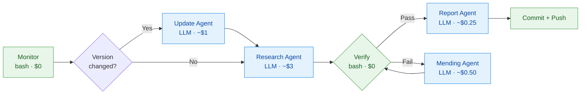
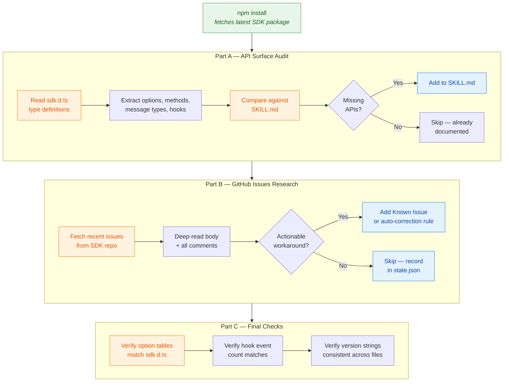
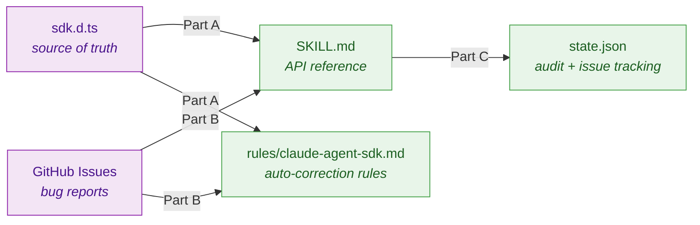

# Claude Agent SDK Skill (Auto-Updated)

A self-updating Claude Code skill for building AI agents with the Claude Agent SDK — covering both [TypeScript](https://github.com/anthropics/claude-agent-sdk-typescript) and [Python](https://github.com/anthropics/claude-agent-sdk-python).

**SDK Version**: TypeScript v0.2.41 | Python v0.1.36 | **This skill is auto-updated**: 2026-02-14

## What It Does

- Complete API reference for both TypeScript and Python SDKs: `query()`, hooks, subagents, MCP, permissions, sandbox, structured outputs, sessions
- Auto-correction rules that fire when editing `*agent*.ts` or `*agent*.py` files
- Known issue prevention with links to real GitHub issues
- Keeps itself up to date via a daily automated pipeline

## Why Auto-Update?

The Claude Agent SDK is pre-1.0 (`v0.2.x`) — APIs break frequently, functions get renamed, parameters change. A static skill would teach Claude outdated patterns that produce broken code. The pipeline keeps this skill accurate by tracking version bumps, researching new issues, and updating rules daily. Without it, advice written for `v0.2.30` silently becomes wrong when the SDK moves to `v0.3.0`.

## Installation

Clone into your Claude Code skills directory:

```bash
git clone https://github.com/xiaolai/claude-agent-sdk-skill-autoupdated ~/.claude/skills/claude-agent-sdk-skill-autoupdated
```

Claude Code loads it automatically. To pull the latest updates later:

```bash
cd ~/.claude/skills/claude-agent-sdk-skill-autoupdated && git pull
```

That's it — no API keys, no pipeline setup, no cost. You get a constantly up-to-date SDK skill maintained by the automated pipeline.

Optional: auto-update daily at 09:00 UTC (after the pipeline runs at 08:00):

```bash
(crontab -l 2>/dev/null; echo "0 9 * * * cd ~/.claude/skills/claude-agent-sdk-skill-autoupdated && git pull -q") | crontab -
```

## Structure

```
SKILL.md                          Router (detects language, loads correct reference)
SKILL-typescript.md               TypeScript API reference
SKILL-python.md                   Python API reference
rules/claude-agent-sdk-ts.md      Auto-correction rules for TS files
rules/claude-agent-sdk-py.md      Auto-correction rules for PY files
templates/typescript/              TypeScript code examples
templates/python/                 Python code examples
scripts/check-versions.sh         Manual version check
agent/                            Self-update pipeline (maintainer only, ignore this)
  monitor.sh                      Change detection (npm + PyPI + GitHub, zero API cost)
  update-agent.ts                 Updates skill files when SDK version changes
  research-agent-ts.ts            Audits TS SDK types + researches GitHub issues daily
  research-agent-py.ts            Audits Python SDK types + researches GitHub issues daily
  mending-agent.ts                Fixes verification failures
  report-agent.ts                 Generates daily reports
  verify.sh                       Deterministic post-update verification
  state.json                      Tracked versions, issues, scan state (namespaced by language)
reports/                          Daily pipeline reports
.github/workflows/                CI pipeline (daily cron)
```

## Daily Pipeline

Runs via GitHub Actions at 08:00 UTC, or manually via `workflow_dispatch`.

### Pipeline Overview

The daily run has two paths depending on whether the SDK version changed.



### What the Research Agent Does

The research agent is the core of the pipeline. It runs daily and has three phases:



### What Gets Updated



### Step Details

| Step | What it does | Cost |
|------|-------------|------|
| **Monitor** | Checks npm registry + GitHub for version bumps, issue state changes, new bugs | $0 (bash) |
| **Update Agent** | Reads change report, updates version strings across all skill files | ~$1 (version bump only) |
| **Research Agent** | **Part A** reads `sdk.d.ts`, compares against SKILL.md, adds missing APIs. **Part B** scans GitHub issues, adds Known Issues or rules. **Part C** validates consistency. | ~$3 |
| **Verify** | Deterministic grep/jq checks on version strings and structure | $0 (bash) |
| **Mending Agent** | Reads verification failures, fixes what broke (up to 2 retries) | ~$0.50/attempt |
| **Report Agent** | Generates pipeline summary, updates cost log in README | ~$0.25 |

## Cost Log

| Date | SDK Version | Update | Research | Report | Total | Notes |
|------|-------------|--------|----------|--------|-------|-------|
| 2026-02-13 | v0.2.39→v0.2.41 | $0.92 | $3.02 | — | **$4.90** | Verify failed (stale version in old report), 2 mending attempts |
| 2026-02-12 | — | — | $1.31 | $0.06 | **$1.37** | Research only, 3 issues evaluated, 2 added |
| 2026-02-11 | — | — | $1.22 | $0.05 | **$1.27** | Research only, 13 issues evaluated |
| 2026-02-10 | — | — | — | — | **—** | Pipeline failed (CLI not installed) |
| 2026-02-09 | v0.2.37 | — | $0.84 | $0.05 | **$0.89** | Research only, 13 issues evaluated |

_Last 7 days only. Updated automatically by the report agent. See [reports/](reports/) for full history._

## How It Works

The daily pipeline runs via GitHub Actions on this repo. It costs the **maintainer** a few dollars per day in LLM usage. The pipeline commits updated skill files directly to this repo.

**As a user**, you just `git pull` to get the latest. You never run the pipeline yourself and pay nothing. You don't need Node.js, npm, or anything in the `agent/` directory — that's maintainer-only infrastructure.

| Role | What you do | Cost |
|------|------------|------|
| **User** | `git clone` / `git pull` | Free |
| **Maintainer** | Runs the CI pipeline | ~$3–6/day |

## Pipeline Prerequisites (maintainer only)

- [Claude Code CLI](https://docs.anthropic.com/en/docs/claude-code) installed on the runner
- GitHub secret: `CLAUDE_CODE_OAUTH_TOKEN` (subscription) or `ANTHROPIC_API_KEY`
- `gh` CLI authenticated (for issue scanning)

## Links

- [SDK Docs](https://platform.claude.com/docs/en/agent-sdk/overview)
- [TypeScript API Reference](https://platform.claude.com/docs/en/agent-sdk/typescript)
- [Python API Reference](https://platform.claude.com/docs/en/agent-sdk/python)
- [TypeScript GitHub](https://github.com/anthropics/claude-agent-sdk-typescript)
- [Python GitHub](https://github.com/anthropics/claude-agent-sdk-python)
- [Migration Guide](https://platform.claude.com/docs/en/agent-sdk/migration-guide)

---

**Repository**: https://github.com/xiaolai/claude-agent-sdk-skill-autoupdated
**License**: MIT
